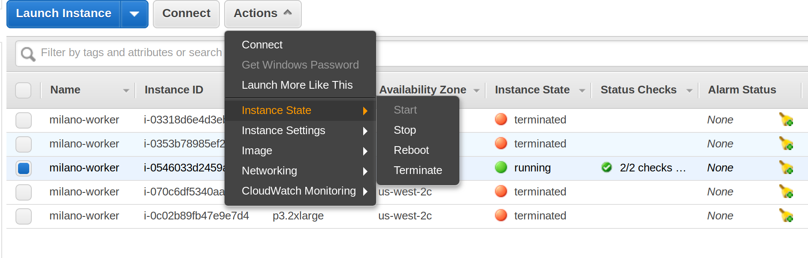

# Quick Start on AWS
This example will demonstrate how to automate hyper-parameter search with Milano on AWS.

## Before you start
If you have a machine with at least on NVIDIA GPU, it is highly recommended that you try Azkaban-based option first.
Please [see here for a quick start mini-tutorial](Quick_start.md).

**When using AWS make sure you are aware of all the costs involved.**

**Once finished, make sure all "milano-worker" instances are termiated! (see screenshot below)**
<div align="left">
  
  <br>
</div>

## Step 1 (Setup AWS access)
* Registed for AWS account.
* Create a file ``~/.aws/credentials`` with the following content
```
[default]
aws_access_key_id = ..fill this..
aws_secret_access_key = ..fill this..
```
* To create your `aws_access_key_id` and `aws_secret_access_key`, please refer to [this AWS document](https://docs.aws.amazon.com/general/latest/gr/managing-aws-access-keys.html).
* You would also need to create a KeyPair in "US-West (Oregon)" region. Go to [https://us-west-2.console.aws.amazon.com/ec2](https://us-west-2.console.aws.amazon.com/ec2) and 
look for Key Pairs. Once you click "Create Key Pair" .pem file will be downloaded.

**Attention:** Keep your AWS credentials secret!

## Step 2 (Create S3 bucket and upload your data there)
Milano uses S3 buckets for storing training data and saving model checkpoints.
* Install AWS CLI utility:  `sudo apt  install awscli` (on Ubuntu Linux)
* Create S3 bucket: * Create S3 bucket: `aws s3api create-bucket --bucket milano-test-data --region us-west-2 --create-bucket-configuration LocationConstraint=us-west-2`
    * This command created an S3 bucket called 'milano-test-data'
    * Make sure you use 'us-west-2' region
* Upload your training data to the bucket you've just created. In the steps below we'll upload CIFAR-10 training data as example:
    * Get data: `wget https://www.cs.toronto.edu/~kriz/cifar-10-binary.tar.gz`
    * Unpack: `tar -xvf cifar-10-binary.tar.gz`
    * Upload: `aws s3 sync cifar-10-batches-bin/ s3://milano-test-data/cifar-10/cifar-10-batches-bin/`

## Step 3 (Prepare the job script)
Take a look at these example job scripts:

* "CIFAR-10 classifier model" ``examples/os2s/cifar10/start_aws.sh``
    * This model uses [OpenSeq2Seq toolkit](https://nvidia.github.io/OpenSeq2Seq) which is based on Tensorflow
    * Note that by default this model will look for the data under ``/data``
* "Simple language model" ``examples/pytorch/wlm/start_wlm_aws.sh``
    * This model uses Pytorch and is taken from Pytorch examples repository without any changes
    * Note that we use ``/workdir`` as working directory

*For both examples, we set number of epoch to 3 to demonstrate the concept*

## Step 4 (Prepare the tuning config)
Take a look at these example tuning configs:
* For CIFAR-10 classifier model: ``examples/os2s/cifar10/cifar10_aws.py``
    * Note "datasets" section of the configuration file - this is how we mount and use S3 bucket with our training set
* For Simple language model: ``examples/pytorch/wlm/wlm_aws.py``

Note that in both cases we set `"num_evals": 3` and `"num_workers": 1` for illustration purposes.

**You might need to contact AWS support to increase the maximum number of P3 instances you can launch at a time.**

### User predefined parameters
Before running any random search it is a good idea to test several configurations pre-defined by users.
You can do it by including ``params_to_try_first`` section in your config.
For example (from `examples/pytorch/wlm/wlm_aws.py`)
```python
# These configurations will be tried first
params_to_try_first = {
  "--model": ["LSTM", "GRU"],
  "--emsize": [1504, 1504],
  "--nlayers": [2, 2],
  "--lr": [20, 25],
  "--bptt": [35, 35],
  "--clip": [0.25, 0.35],
  "--dropout": [0.2, 0.2],
}
```
The above dictionary defines 2 configurations which (one with LSTM and another one with GRU cells) which will be tried 
before RandomSearch algorithm starts.

## Step 5 (Start tuning)
From the client machine run:

"Simple language model": ``python tune.py --config=examples/pytorch/wlm/wlm_aws.py --verbose 3``

or
"CIFAR-10 classifier model": ``python tune.py --config=examples/os2s/cifar10/cifar10_aws.py --verbose 3``

## Results
By default, the results will be saved in the file ``results.csv``. They will be ordered with the top results first.
Also, it will be updated on the fly, as results come in.
If a job failed for whatever reason, it will be still logged in ``results.csv`` with ``inf`` as a result.
